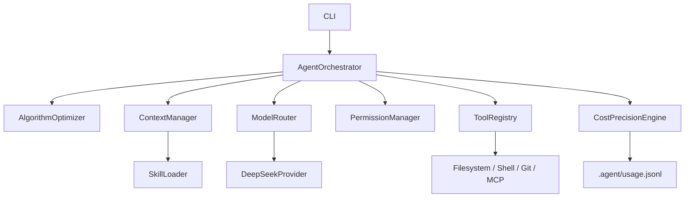

# Architecture

## Runtime Flow

## Decisions

### ADR-001: Local Modular Monolith

Use one Node.js CLI process with explicit module boundaries. This keeps MVP development fast while preserving future extension points for MCP, TUI, subagents, and multiple providers.

### ADR-002: DeepSeek First, Provider Interface Always

DeepSeek is the first-class implementation, but the orchestrator depends on a `ModelProvider` interface. This keeps routing and context optimization independent from a single SDK.

### ADR-003: Cache Stability Over Prompt Cleverness

Stable rules and project summaries are ordered deterministically before dynamic task data. This improves DeepSeek prefix cache reuse and makes cache misses easier to diagnose.

### ADR-004: Lazy Tool and Skill Loading

The runtime selects tool schemas by task profile and only loads skill bodies when skill metadata matches the task. This reduces prompt bloat while keeping the model aware of available capabilities.
